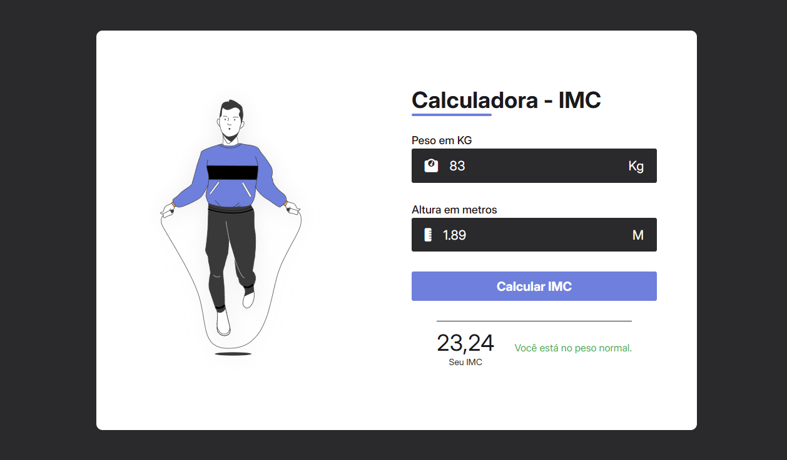

# 📊 Calculadora de IMC

Uma calculadora de Índice de Massa Corporal (IMC) simples e interativa, desenvolvida em HTML, CSS e JavaScript. Este projeto permite que os usuários calculem seu IMC e recebam uma classificação com base no resultado.

## 🚀 Funcionalidades

<ul>
  <li>Cálculo de IMC: Insira seu peso e altura para calcular o IMC.</li>
  <li>Classificação Automática: Receba uma classificação com base no valor do IMC (abaixo do peso, peso normal, sobrepeso, etc.).</li>
  <li>Cores de Aviso: Cada classificação é exibida com uma cor correspondente para facilitar a interpretação.</li>
  <li>Interface Amigável: Design moderno e responsivo, com ícones e mensagens claras.</li>
</ul>

## 🖼️ Captura de tela



## 📦 Como Usar

1. **Clone o repositório**:
   ```sh
   git clone https://github.com/AkiroSetonai/CALCULADORA-IMC.git
   ```
2. **acesse a pasta do projeto:**
   ```sh
   cd CALCULADORA-IMC
   ```
